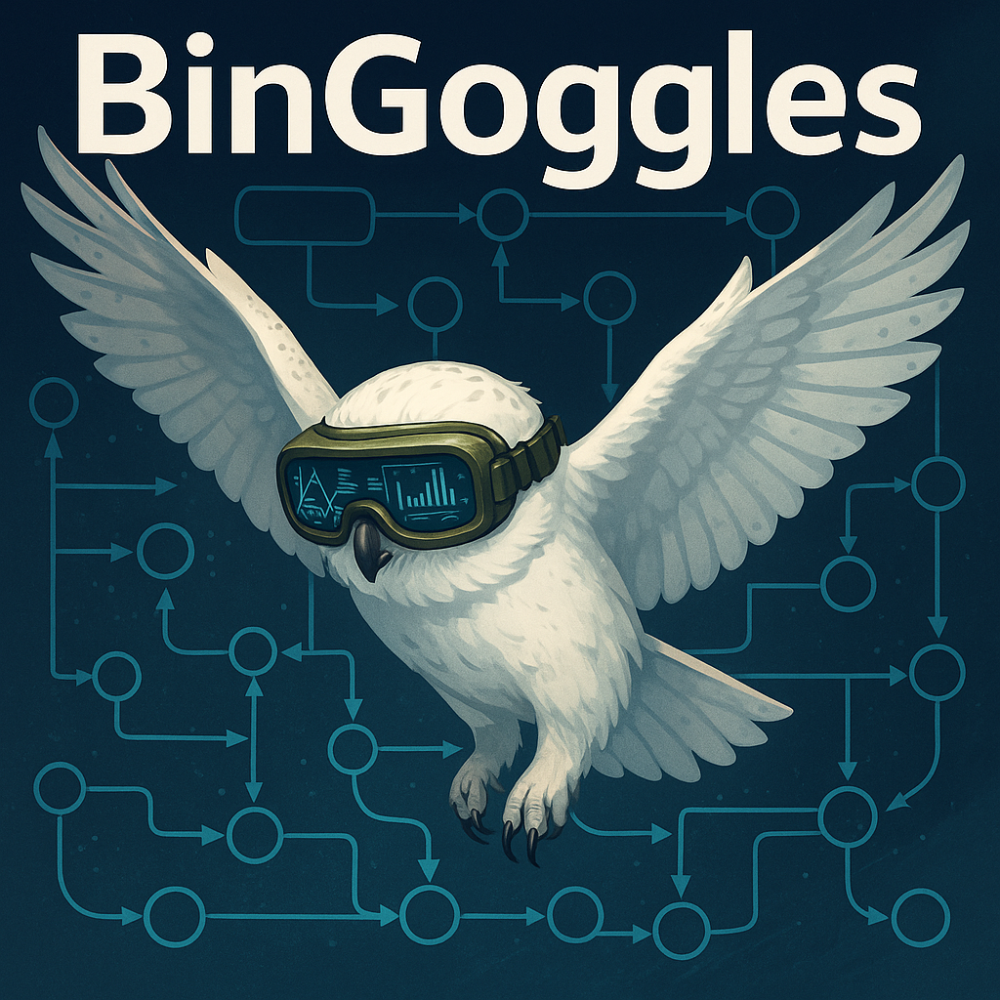

## `BinGoggles` — The Variable Flow Engine


BinGoggles is a powerful static taint analysis framework for Binary Ninja. It tracks variable flow both *within* and *across* functions, supporting full inter/intraprocedural slicing, including globals, structs, and function parameters.

With **100+ modeled libc functions** and support for custom function models, BinGoggles provides deep, accurate taint propagation for security research and vulnerability discovery.

**Want to write your own analysis?** Start with `bingoggles/modules.py` — it shows how UAF (Use-After-Free) detection was built using the core engine.

### What is a "Complete Slice"?
A **complete slice** traces a tainted variable's full journey through function calls, across boundaries, and deep into control/data paths. It's end-to-end propagation, made simple.

## How is BinGoggles Unique?
- [x] **Platform agnostic** – Runs on Linux, macOS, and Windows
- [x] **Intraprocedural and interprocedural analysis** – Track variable flow within and across functions
- [x] **100+ modeled functions** – Extensive libc/system call models with automatic taint propagation
- [x] **Imported function analysis** – User defines any external libraries for deeper analysis
- [x] **Architecture/language agnostic (mostly)** – Works with any binary that loads into Binary Ninja
- [x] **Supports all variable types** – Local variables, struct members, globals, and function parameters
- [x] **Easy-to-use API** – Designed for extensibility with plenty of usage examples
- [x] **Bidirectional taint analysis** – Supports both forward and backward slicing
- [x] **Embedded-friendly** – Well-suited for firmware and embedded target analysis
- [x] **Headless compatible** – Supports both Hugsy's and Binary Ninja's headless modes
- [x] **Variadic function call resolution & patching** – Automatically identifies, resolves, and patches function calls with variable-length arguments
- [x] **Vulnerability detection modules** – Built-in Use-After-Free detection with extensible module framework

## Installation

### Prerequisites
- **Binary Ninja** (Commercial or Personal license)
- **Python 3.8+**
- Binary Ninja Python API installed

### Setup Instructions

#### Step 1: Create Python Virtual Environment
```bash
python3 -m venv .bg
source .bg/bin/activate  # On Windows: .bg\Scripts\activate
```

#### Step 2: Install Dependencies
```bash
# Install BinGoggles requirements
pip install -r requirements.txt

# Install Binary Ninja API in the virtual environment
# (Adjust path to your Binary Ninja installation)
/path/to/binaryninja/scripts/linux-setup.sh    # Linux
# OR for macOS/Windows, follow Binary Ninja's API setup instructions

# Install BinGoggles in development mode
pip install -e .
```

#### Step 3: Verify Installation
```bash
# Run a quick test to verify everything works
python3 -m pytest test/test_cases.py::test_fwd_slice_param -v
```

## Usage Examples

### Basic Usage (Binary Ninja Headless)
```python
from bingoggles.bingoggles_types import *
from bingoggles.bg import Analysis

# Initialize BinGoggles with a binary
test_bin_path = "/path/to/your/binary"
bg_init = BGInit(target_bin=test_bin_path)
bv, libraries_mapped = bg_init.init()

# Create analysis object
analysis = Analysis(
    binaryview=bv, 
    verbose=True, 
    libraries_mapped=libraries_mapped
)

# Perform forward slice from a variable
tainted_locs, func_name, tainted_vars = analysis.tainted_slice(
    target=TaintTarget(0x00401A6F, "buffer"),
    var_type=SlicingID.FunctionVar,
    slice_type=SliceType.Forward,
    output=OutputMode.Returned
)

print(f"Found {len(tainted_locs)} tainted locations in {func_name}")
```

### Complete Interprocedural Slice
```python
# Trace a variable across multiple functions
slice_data = analysis.complete_slice(
    target=TaintTarget(0x00401AA6, "rax"),
    var_type=SlicingID.FunctionVar,
    slice_type=SliceType.Forward
)

# slice_data is a dict: {(function_name, var): ([TaintedLOC], [TaintedVar])}
for (func, var), (locs, vars) in slice_data.items():
    print(f"{func} -> {var}: {len(locs)} locations")
```

### Backward Slice (Finding Sources)
```python
# Trace backwards from a sink to find sources
sources, func_name, tainted_vars = analysis.tainted_slice(
    target=TaintTarget(0x004018DC, "rdx_1"),
    var_type=SlicingID.FunctionVar,
    slice_type=SliceType.Backward,
    output=OutputMode.Returned
)
```

### Struct Member Tracking
```python
# Track specific struct member propagation
struct_locs, func_name, tainted_vars = analysis.tainted_slice(
    target=TaintTarget(0x00401A6F, "ptr"),
    var_type=SlicingID.StructMember,
    slice_type=SliceType.Forward
)
```

### Use-After-Free Detection
```python
from bingoggles.modules import UseAfterFreeDetection

# Run complete slice on an allocation
slice_data = analysis.complete_slice(
    target=TaintTarget(0x00401AA6, "buffer"),
    var_type=SlicingID.FunctionVar,
    slice_type=SliceType.Forward
)

# Detect UAF vulnerabilities
uaf_scanner = UseAfterFreeDetection(bv, slice_data)
vulnerabilities = uaf_scanner.analyzer()

for vuln in vulnerabilities:
    print(f"UAF detected: {len(vuln.vulnerable_path_data)} locations")
    for loc in vuln.vulnerable_path_data:
        print(f"  {hex(loc.addr)}: {loc.loc}")
```

### Using BinGoggles with [Hugsy Headless](https://github.com/hugsy/binja-headless)
For RPyC-based headless mode (requires Hugsy setup):
```python
from bingoggles.bingoggles_types import *
from bingoggles.bg import Analysis

# Use RPyC initialization
bg_init = BGInitRpyc(
    target_bin="/path/to/binary",
    host="127.0.0.1",
    port=18812
)
bv, libraries_mapped = bg_init.init()

analysis = Analysis(binaryview=bv, verbose=True, libraries_mapped=libraries_mapped)
# ... rest of analysis code
```

### Running Tests
```bash
# Run all tests
python3 -m pytest test/test_cases.py -v

# Run specific test
python3 -m pytest test/test_cases.py::test_global_tracking_fwd_var -v

# Run with RPyC/Hugsy headless mode
python3 -m pytest test/test_cases.py::test_fwd_slice_param -v --rpyc

# Run with verbose output
python3 -m pytest test/test_cases.py -sv
```

## Documentation

### Generating Sphinx Documentation

BinGoggles uses Sphinx to generate comprehensive API documentation from docstrings.

#### Prerequisites
```bash
# Install Sphinx dependencies (if not already installed)
pip install -r requirements-sphinx.txt
```

#### Build HTML Documentation
```bash
# Navigate to docs directory
cd docs

# Generate HTML documentation
make html

# Open in browser (Linux)
xdg-open build/html/index.html

# Or for macOS
open build/html/index.html

# Or for Windows
start build/html/index.html
```

#### Clean and Rebuild
```bash
cd docs
make clean   # Remove old build files
make html    # Generate fresh documentation
```

#### Alternative: Build PDF Documentation
```bash
cd docs
make latexpdf  # Requires LaTeX installation
```

The generated documentation includes:
- Full API reference for all modules
- Class and function signatures
- Detailed parameter descriptions
- Usage examples from docstrings
- Module interdependencies

### Online Documentation
For the latest documentation, visit the [BinGoggles Documentation](https://bingoggles.readthedocs.io) (if hosted).

## Key Features Explained

### Function Models
BinGoggles includes 100+ pre-built function models for common libc and system functions:
- **Memory functions**: `malloc`, `free`, `memcpy`, `memmove`, `realloc`
- **String functions**: `strcpy`, `strcat`, `strlen`, `strcmp`, `strdup`
- **I/O functions**: `fgets`, `fread`, `scanf`, `printf`, `read`, `write`
- **File operations**: `fopen`, `fclose`, `open`, `openat`
- **Environment**: `getenv`, `setenv`, `getcwd`, `realpath`

Each model defines:
- **Taint sources**: Which parameters introduce taint
- **Taint destinations**: Which parameters receive taint
- **Return value tainting**: Whether the return value is tainted
- **Variadic support**: Handling for `printf`/`scanf` family functions

### Custom Function Models
Extend BinGoggles with your own function models:
```python
from bingoggles.bingoggles_types import FunctionModel

# Define a custom function model
custom_model = FunctionModel(
    name="my_custom_copy",
    taint_sources=[1],        # param index 1 is the source
    taint_destinations=[0],   # param index 0 receives taint
    taints_return=False       # return value not tainted
)
```

### Slicing Types
- **Forward slicing**: Trace from source to all possible sinks
- **Backward slicing**: Trace from sink back to all possible sources
- **Complete slicing**: Full interprocedural analysis across function boundaries

### Variable Types
- **FunctionVar**: Local variables within a function
- **FunctionParam**: Function parameters (formal arguments)
- **GlobalVar**: Global variables and constants
- **StructMember**: Individual fields within struct types

## Troubleshooting

### Common Issues

**Binary Ninja API not found:**
```bash
# Make sure Binary Ninja's Python API is in your PYTHONPATH
export PYTHONPATH="/path/to/binaryninja/python:$PYTHONPATH"
```

**Tests failing:**
```bash
# Ensure .bndb files are generated for test binaries
# BinGoggles will auto-create them on first run, but this takes time
```

**Headless mode errors:**
```bash
# Verify Binary Ninja license supports headless operation
# Commercial licenses required for full headless functionality
```

## Contributing

We welcome contributions from the community! Here's how you can help:

### Report Issues
If you encounter a bug or have a feature request:
1. Check existing issues to avoid duplicates
2. Open a new issue with detailed reproduction steps
3. Include Binary Ninja version, Python version, and OS
4. Attach relevant code snippets or binaries (if possible)

### Submit Pull Requests
Want to improve the code or documentation?
1. Fork the repository
2. Create a feature branch (`git checkout -b feature/my-improvement`)
3. Make your changes with clear commit messages
4. Add tests for new functionality
5. Update documentation as needed
6. Submit a pull request with a detailed description

### Code Style
- Follow PEP 8 style guidelines
- Add docstrings to all public functions/classes
- Include type hints where appropriate
- Write meaningful commit messages (use conventional commits)

### Testing
```bash
# Run the full test suite before submitting PRs
python3 -m pytest test/test_cases.py -v

# Ensure all tests pass
```

### Spread the Word
- Star the repository
- Write blog posts or tutorials using BinGoggles!
- Share on social media (Twitter/X, LinkedIn, etc.)
- Join discussions in issues and pull requests
- Present at conferences or meetups

## License

BinGoggles is released under the Apache License. See [LICENSE](LICENSE) for details.

## Acknowledgments

- Built on top of [Binary Ninja](https://binary.ninja/)
- Supports [Hugsy's headless mode](https://github.com/hugsy/binja-headless)
- Inspired by classic taint analysis research

## Citation

If you use BinGoggles in your research, please cite:
```bibtex
@software{bingoggles,
  title = {BinGoggles: A Variable Flow Engine for Binary Ninja},
  author = {Pwnpope},
  url = {https://github.com/pwnpope/BinGoggles}
}
```

---

**Thank you for helping make BinGoggles better!**
